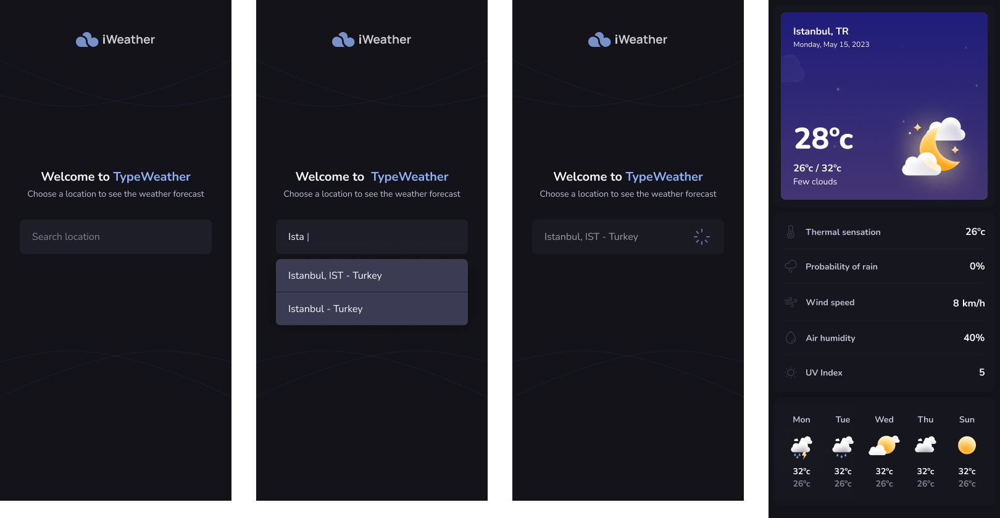
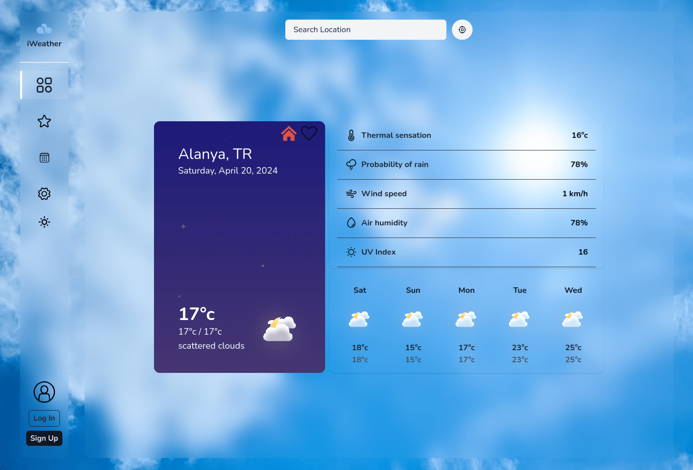
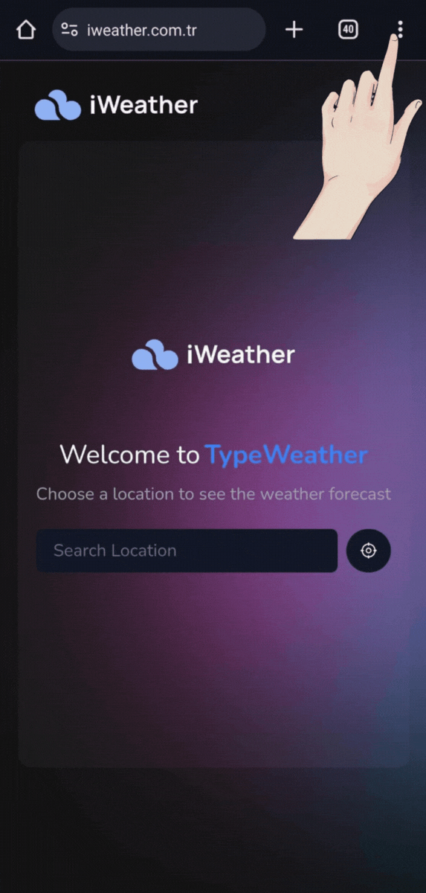
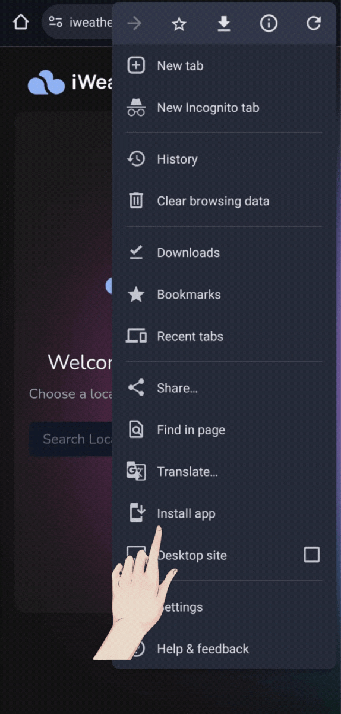

# **React Internship Interview Project - React**
For English: [README-en.md](README-en.md)
- Current domain: [iweather.com.tr](https://iweather.com.tr)
- Alternative domain: [iweather-dev.vercel.app](https://iweather-dev.vercel.app)

## Sample Design
This project is a weather application that displays current weather information for the selected city by the user. The application fetches real-time data from a popular weather API like OpenWeatherMap. The following Design is given as an example, and we were asked to add the desired details.

## Project Design
Many features have been added and removed, and in the end, I was able to create a custom design like the one below. This design is not taken from anywhere and is completely created with my CSS knowledge by looking at sample weather applications and adding details requested from us.

## Downloading the Application to Mobile
- You can download the application to your phone by going to the current or alternative site from the browser on your phone, clicking on the three dots in the upper right corner, and then clicking on `install the application`.

## Technologies Used
- **React:** Provides a component-based structure for frontend development, increasing the modularity of the application.
- **next:** I use next.js to develop React applications because it offers performance-enhancing features such as SSR (Server Side Rendering) and ISR (Incremental Static Regeneration), and helps create SEO-friendly applications.
- **TypeScript:** Provides safer coding due to its attention to data types and allows smooth coding in large projects.
- **Tailwind CSS:** Allows faster conversion of designs to CSS with less code writing and flexibility for customization.
- **axios:** It has a simple and reliable usage for making HTTP requests and can easily interact with RESTful APIs.
- **react-query:** Provides convenience in managing API requests in React applications, offers features like caching and automatic refreshing, and is easy to use.
- **firebase:** Firebase platform is easy to use and offers many features such as session management, database, and hosting in one platform.
- **formik:** Simplifies form operations for form management, offers features like validation and error handling.
- **dotenv:** Allows loading environmental variables to enable the project to run in different environments and securely store sensitive information.
- **next-themes:** Allows easy switching of themes in Next.js projects and applies themes based on user preferences.
- **react-hot-toast:**  I use it to show notifications to users.
- **yup:** Schema-based validation simplifies data validation processes, is customizable, and is a widely used validation library.

# **Helper Functions Used in the Project**
### useFirebase
This hook easily connects to Firebase and controls the relevant user data. Features I use:
- **SignInwihEmailPassword**
- **SignInwithGoogle**
- **CreateUserWithEmailPassword**
- **User:** With this object, I can keep user-related operations in a single object, for example (name, email, logOut(), changePassword(new), stars, deleteUser() ... )

### Data Provider
- **data:** This data allows me to easily transfer weather data for a city between components.
- **city:** I used this data because when selecting major cities, the city name from the API is actually the district of the selected city (For example: When we search for Istanbul and click on Istanbul in the search section, we encounter the weather of the district 'Karaköy' in the weather section. I used it to prevent this situation, in fact, I manipulate the data.)
- **homeCities:** This data allows users to add their desired city to the homepage without the need to log in.

### useLocalStorage
Since I use next.js in the project, the local storage function is only used in SSR (Server Side Rendering), so it solves this problem and provides a more dynamic data saving function.

### useLocation
A helper function that takes and processes location information from the user.

# **Routing Used in the Project**
- Homepage: [iweather-dev.vercel.app](https://iweather-dev.vercel.app)
- Login: [iweather-dev.vercel.app/login](https://iweather-dev.vercel.app/login)
- Register: [iweather-dev.vercel.app/register](https://iweather-dev.vercel.app/register)
- Stars: [iweather-dev.vercel.app/stars](https://iweather-dev.vercel.app/stars)
- Settings: [iweather-dev.vercel.app/settings](https://iweather-dev.vercel.app/settings)
- Calendar: [iweather-dev.vercel.app/calendar](https://iweather-dev.vercel.app/calendar)

### City Search Routing
After `city/`, the city name should be followed by a `-` and the country name.
- Istanbul, Turkey: [iweather-dev.vercel.app/city/istanbul-tr](https://iweather-dev.vercel.app/city/istanbul-tr)

### Longitude, Latitude Search Routing
After `location/`, Longitude `_` Latitude should be written.
- For Alanya: [iweather-dev.vercel.app/location/31.9998_36.5438](https://iweather-dev.vercel.app/city/31.9998_36.5438)

# **Extra Features Used in the Project**
### metadata

### manifest.ts
Through the manifest, the application can be downloaded to the phone.

# **Required Features in the Project**

### Core Features

- **API Usage:** Real-time weather data is fetched using the OpenWeatherMap API.
- **Weather Details:** Basic information such as temperature, humidity, wind speed, and weather description of the selected city is displayed.
- **Search Functionality:** Users query the current weather information for a city by entering the city name.
- **Multi-City Support:** Users should be able to view weather information for multiple cities sequentially.

### Additional Features

- **Geolocation Support:** Automatically provides weather information based on the user's current location.
- **Charts and Visualization:** Certain data is visualized through charts.
- **Responsive Design:** The application should be displayed properly on various devices and screen sizes.
- **Weather Icons:** Dynamic icons or images reflecting the current weather should be used.

### Technical Details

- **Axios Usage:** Axios is used for data fetching operations.
- **Frontend Technologies:** React Native is used.
- **Error Handling:** Clear messages are displayed to the user for possible errors in API queries (incorrect city name, API limit exceeded, etc.).
- **Weather Icons:** Dynamic icons or images reflecting the current weather are used.

## Installation

To run the project, follow the steps below:
1. Use the command `git clone https://github.com/ayazwx/iweather.com.tr.git` to download the files to your computer.
2. Navigate to the project directory by using the command `cd iweather.com.tr`.
3. Install the necessary dependencies using the command `npm install`.
4. Start the application by using the command `npm run dev`. You may need to have `next` installed to use this command.

