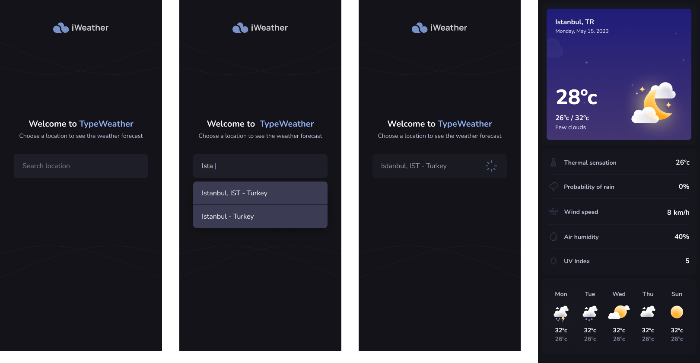
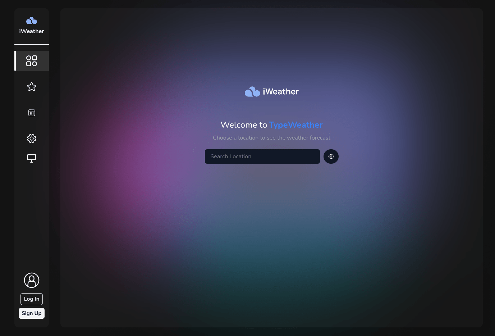
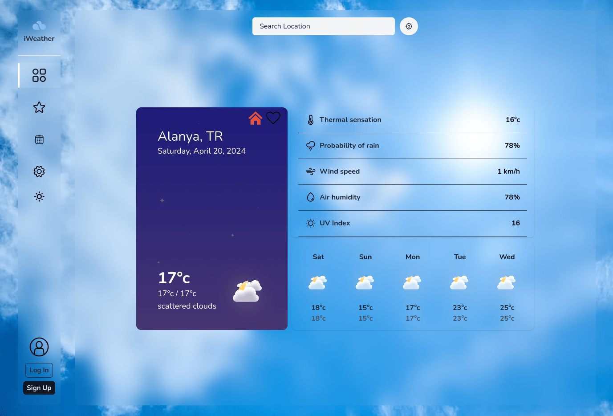
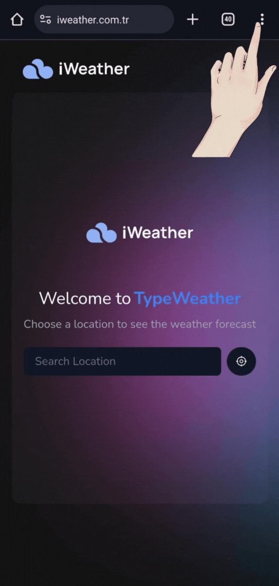
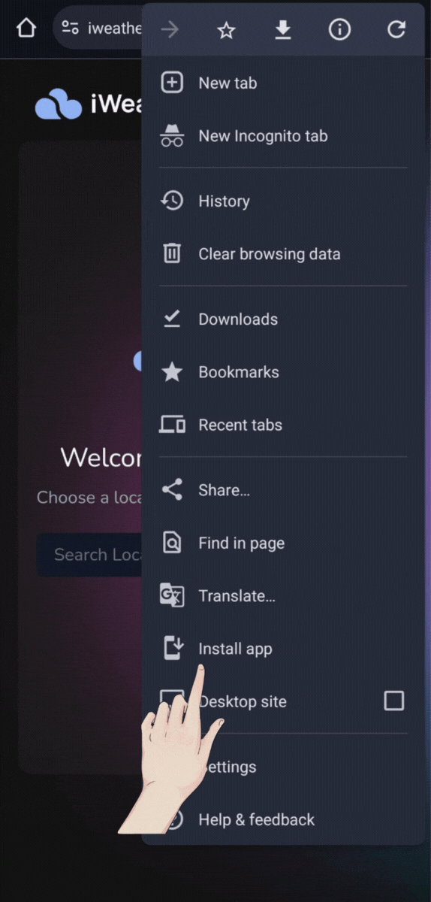

# **React Staj Mülakat Projesi - React**
For English: [README-en.md](README-en.md)
- Güncel domain: [iweather.com.tr](https://iweather.com.tr)
- Alternatif domain: [iweather-dev.vercel.app](https://iweather-dev.vercel.app)

## Örnek Tasarım
Bu proje, kullanıcının seçtiği şehrin güncel hava durumu bilgilerini gösteren bir hava durumu uygulamasıdır. Uygulama, OpenWeatherMap gibi popüler bir hava durumu API'sinden gerçek zamanlı verileri çeker. Aşağıdaki Tasarım örenk olarak verilip, istediğimiz detayı eklememiz istendi.

## Proje Tasarımı
Eklenen ve çıkarılan birçok özellik oldu ve en sonda aşağıdaki gibi özel bir tasarım yapabildim. Bu tasarım hiçbir yerden alınmayıp tamamen örnek hava durumu uygulamalarına bakıp ve bizden istenilen tasarıma ekleme yaparak tasarımını kendi css bilgimle oluşturmuş olduğum bir projedir.

## Telefona uygulama olarak indirmek için
- Telefonda tarayıcıdan güncel veya alternatif siteye gidip sağ üst kısımdaki üç nokta tıklanıp `uygulamayı yükle` yee tıklayıp uygulamayı kendi telefonunuza indirebilirsiniz.

## Kullanılan Teknolojiler
- **React:** Frontend geliştirme için bileşen tabanlı bir yapı sunar ve uygulamanın modülerliğini artırır.
- **next:** React uygulamalarını geliştirmek için next.js kullanıyorum çünkü SSR (Sunucu Taraflı Rendeleme) ve ISR (Yerinde Sayfa Yenileme) gibi performans artırıcı özellikleri sunar ve SEO dostu uygulamalar oluşturmamıza yardımcı olur.
- **TypeScript:** Veri tiplerine dikkate etmesinden dolayı daha güvenli kodlama sağlar ve büyük projelerde sorunsuz kod yazamamızı sağlar.
- **Tailwind CSS:** Daha az css yazma, esnek ve özelleştirilebilirliği sayesinde hızlıca tasarımları css'e geçirmeyi sağlar.
- **axios:** HTTP istekleri yapmak için axios basit ve güvenilir bir kullanıma sahiptir ve RESTful API'lerle kolayca etkileşim kurabilir.
- **react-query:** React uygulamalarında veri yönetimi için API isteklerini yönetirken kolaylık sağlar, önbellekleme ve otomatik yenileme gibi özellikler sunar ve kullanımı kolaydır.
- **firebase:** Firebase platformunun kullanımı kolaydır ve oturum yönetimi, veritabanı ve barındırma gibi birçok özelliği tek bir platformda sunar.
- **formik:** Form yönetimi için form işlemlerini kolaylaştırır, doğrulama ve hata yönetimi gibi özellikler sunar.
- **dotenv:** Çevresel değişkenleri yüklemek için dotenv projenin farklı ortamlarda çalışmasını sağlar ve gizli bilgileri güvenli bir şekilde saklanmasını sağlar.
- **next-themes:** Next.js projelerinde kolayca temaları değiştirmemize olanak tanır ve kullanıcı tercihlerine dayalı olarak temaları uygular.
- **react-hot-toast:**  Kullanıcıya bildirimler göstermek için kullanıyorum.
- **yup:** Şema tabanlı doğrulama, veri doğrulama işlemlerini basitleştirir, özelleştirilebilir ve yaygın olarak kullanılan bir doğrulama kütüphanesidir.

# **Projede Kullanılanlar Yardımcı Fonksiyonlar**
### useFirebase
Bu hook firebase'e kolaylıkla bağlanıp ilgili kullanıcı verilerini kontrol eder. kullanığım özellikleri:
- **SignInwihEmailPassword**
- **SignInwithGoogle**
- **CreateUserWithEmailPassword**
- **User:** Kullandığım bu obje sayesinde kullanıcıyla ilgili işlemleri tek bir objede tutabiliyorum, örnek (isim, email, logOut(), changePassword(new), stars, deleteUser() ... )

### Data Provider
- **data:** Bu veri sayesinde şehire ait hava durumunu componentler arasında kolaylıkla aktarabiliyor.
- **city:** Bu veriyi kullanmamın asıl sebebi büyük şehirleri seçerken api'den gelen şehir isminin asıl seçilen şehirin ilçesi olmasından dolayı ihtiyaç duydum. (Örneğin: İstanbul diye arattığımızde arama kısmında İstanbul'a tıkladığımız zaman, hava durumu kısmında 'Karaköy' semtinin hava durumu ile karşılaşıyoruz, bu durumu engellemek için kullandım, aslında veriyi manipüle ediyorum.)
- **homeCities:** Bu veri kullanıcı giriş yapmasına gerek kalmadan kullanıcı istediği şehiri anasayfaya ekleyebilmesini sağlar.

### useLocalStorage
Projede next.js kullandığımdan dolayı localstorage fonksiyonu yalnızca SSR (Sunucu Taraflı Rendeleme)'de kullanılıyor, hem bu soruna çözüm bulmak hem de daha dinamik bir veri kaydetme fonksiyonu sağlar.

### useLocation
Kullanıcıdan konum bilgisini alıp işleyen yardımcı fonksiyondur.

# **Projede Kullanılan Routing**
- anasayfa: [iweather-dev.vercel.app](https://iweather-dev.vercel.app)
- login: [iweather-dev.vercel.app/login](https://iweather-dev.vercel.app/login)
- register: [iweather-dev.vercel.app/register](https://iweather-dev.vercel.app/register)
- stars: [iweather-dev.vercel.app/stars](https://iweather-dev.vercel.app/stars)
- settings: [iweather-dev.vercel.app/settings](https://iweather-dev.vercel.app/settings)
- calendar: [iweather-dev.vercel.app/calendar](https://iweather-dev.vercel.app/calendar)

### Şehir Arama Routing
`city/` den sonra şehir ismi `-` bulunduğu ülke yazılması gerekiyor.
- [iweather-dev.vercel.app/city/istanbul-tr](https://iweather-dev.vercel.app/city/istanbul-tr)

### Longitude, Latitude Arama Routing
`location/` den sonra Longitude `_` Latitude yazılması gerekiyor.
- ALanya için: [iweather-dev.vercel.app/location/31.9998_36.5438](https://iweather-dev.vercel.app/city/31.9998_36.5438)

# **Projede Kullanılan Ekstra Özellikler**
### metadata

### manifest.ts
Manifest sayesinde telefona uygulama olarak indirilebilir.

# **Projede istenilen Gereksinimler**

### Ana Özellikler

- **API Kullanımı:** OpenWeatherMap API'si kullanılarak gerçek zamanlı hava durumu veriler çekilir.
- **Hava Durumu Detayları:** Seçilen şehrin sıcaklık, nem, rüzgar hızı, hava durumu açıklaması gibi temel bilgiler gösterilir.
- **Arama İşlevi:** Kullanıcılar, şehir adı girerek o şehre ait güncel hava durumu bilgilerini sorgular.
- **Çoklu Şehir Desteği:** Kullanıcılar, birden fazla şehrin hava durumu bilgisini sırayla görüntüleyebilmelidir.

### Ek Özellikler

- **Geolokasyon Desteği:** Kullanıcının mevcut konumunu kullanarak otomatik hava durumu bilgisi sağlanır.
- **Grafikler ve Görselleştirme:** Belirli veriler grafikler aracılığıyla görselleştirilir.
- **Responsive Tasarım:** Uygulama, çeşitli cihaz ve ekran boyutlarında düzgün bir şekilde görüntülenmelidir.
- **Hava Durumu İkonları:** Mevcut hava durumunu yansıtan dinamik ikonlar veya görseller kullanılmalıdır.

### Teknik Detaylar

- **Axios Kullanımı:** Veri çekme işlemleri için Axios kullanılır.
- **Frontend Teknolojileri:** React Native kullanılır.
- **Hata Yönetimi**: API sorgularında oluşabilecek hatalar (yanlış şehir adı, API limit aşımı vb.) kullanıcıya anlaşılır mesajlar halinde gösterilir.
- **Hava Durumu İkonları**: Mevcut hava durumunu yansıtan dinamik ikonlar veya görseller kullanılır.

## Kurulum

Projeyi çalıştırmak için aşağıdaki adımları izleyin:
1. `git clone https://github.com/ayazwx/iweather.com.tr.git` komutunu kullanark dosyaları bilgisayarınıza indirin.
2. `cd iweather.com.tr` komutunu kullanarak proje dizinine gidin.
3. `npm install` komutunu kullanarak gerekli bağımlılıkları yükleyin.
4. `npm run dev` komutunu kullanarak uygulamayı başlatın. Bu komutu kullanmak için `next` in yüklü olması gerekebilir.